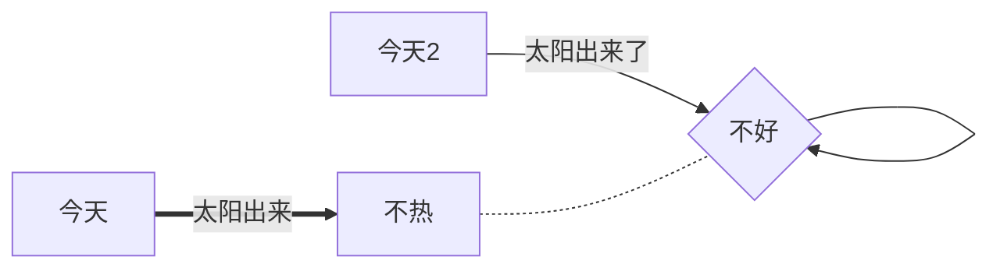
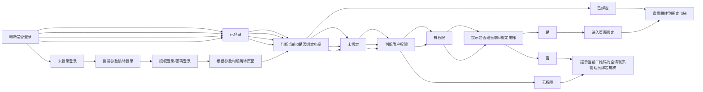

TB | 从上到下
BT | 从下到上
RL | 从右到左
LR | 从左到右

```mermaid
graph LR

今天2 -- 太阳出来了 --> id((天气很热))  

今天 == 太阳出来 ==> 不热 -.- id>好] --> id{不好}
```

```mermaid 

graph LR

 判断是否登录-->已登录-->判断当前id是否绑定电梯-->已绑定-->重置跳转到指定电梯
 
 判断是否登录-->已登录-->判断当前id是否绑定电梯-->未绑定-->判断用户权限-->有权限-->提示是否给当前id绑定电梯-->是-->进入页面绑定-->重置跳转到指定电梯

 判断是否登录-->已登录-->判断当前id是否绑定电梯-->未绑定-->判断用户权限-->有权限-->提示是否给当前id绑定电梯-->否 -->提示当前二维码为空请联系管理员绑定电梯

 判断是否登录-->已登录-->判断当前id是否绑定电梯-->未绑定-->判断用户权限-->无权限-->提示当前二维码为空请联系管理员绑定电梯

 判断是否登录-->未登录登录-->携带参数跳转登录 -->授权登录/密码登录-->根据参数判断跳转页面-->判断当前id是否绑定电梯

 
```